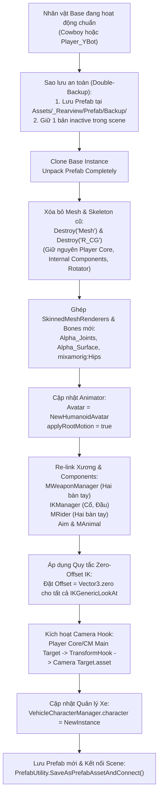

# Humanoid Character Update & Replacement Pipeline

Tài liệu quy chuẩn kỹ thuật chuẩn hóa quy trình **thay thế, cập nhật model và xử lý rig** cho nhân vật Humanoid 3D điều khiển bằng **Malbers Animations Horse AnimSet Pro (HAP) & Animal Controller** và tích hợp với **Realistic Car Controller (RCC)** trong dự án *The Last Waypoint*.

---

## 1. Triết lý kiến trúc: Quy tắc "Clone & Swap"

> [!CAUTION]
> **TUYỆT ĐỐI KHÔNG BAO GIỜ KÉO TRỰC TIẾP FILE FBX VÀO SCENE LÀM NHÂN VẬT CHÍNH!**
> 
> Nhân vật trong Malbers Animal Controller là một hệ thống phức hợp bao gồm:
> - **15 root components** liên kết chặt chẽ (`MAnimal`, `MInputLink`, `PlayerInput`, `ComponentSelector`, `Stats`, `MDamageable`, `Aim`, `MWeaponManager`, `IKManager`, `Tags`, `MRider`, `Rigidbody`, `CapsuleCollider`, `Animator`, `Transform`).
> - **3 cây phân cấp GameObject con thiết yếu**: `Player Core`, `Internal Components`, `Rotator`.
> - **Hàng chục UnityEvent và ScriptableObject Hook** (`Camera Target.asset`, `Aim Position`, `Stamina Data`,...).
>
> Kéo FBX thô vào scene và chỉ add `MAnimal` sẽ **làm hỏng toàn bộ cơ chế raycast ground check, làm nhân vật lún đất 0.625m, làm camera nhìn lên trời và tê liệt hệ thống tương tác xe.**

### Quy trình "Clone & Swap" chuẩn:



---

## 2. Quy chuẩn Double-Backup an toàn

Trước khi thực hiện bất kỳ thao tác thay thế nào, bắt buộc phải bảo toàn nhân vật đang hoạt động:

1. **Sao lưu Prefab độc lập:**
   - Thư mục sao lưu: `Assets/_Rearview/Prefab/Backup/`
   - Đặt tên theo cú pháp: `<CharacterName>_Backup.prefab` (ví dụ: `Cowboy_Backup.prefab`).
   - Sử dụng `PrefabUtility.SaveAsPrefabAsset(source, backupPath)`.
2. **Bảo tồn In-Scene Instance:**
   - Đổi tên object cũ thành `<CharacterName> (Backup)`.
   - Vô hiệu hóa: `source.SetActive(false);`.
   - Giữ lại trong scene để có thể bật lại tức thì khi cần kiểm tra đối chiếu.
3. **Phát hiện & Dọn dẹp Stale Backups:**
   - Khi tìm nhân vật base để clone, phải kiểm tra component đặc trưng (`GetComponent<MRider>() != null && transform.Find("Player Core") != null`).
   - Xóa bỏ các bản copy rác hoặc backup bị lỗi từ các lần import trước đó để tránh clone nhầm bản hỏng.

---

## 3. Quy chuẩn Rigging & Import Model FBX

Khi chuẩn bị một model nhân vật mới (từ Mixamo, Blender, Synty,...):

### 3.1 Cấu hình ModelImporter (Inspector Tab Rig)
- **Animation Type:** `Humanoid` (`ModelImporterAnimationType.Human`).
- **Avatar Definition:** `Create From This Model` (`ModelImporterAvatarSetup.CreateFromThisModel`).
- Đảm bảo trong tab Rig, Unity hiển thị dấu tích xanh **"✓ Humanoid"** và không có lỗi thiếu xương (bắt buộc phải map đủ Hips, Spine, Chest, Neck, Head, Arms, Legs).

### 3.2 Phân định Layer cho các thành phần con
- **Toàn bộ SkinnedMeshRenderer (Mesh hình ảnh):** Gán Layer `20` (`Animal`).
- **Toàn bộ Xương (Bones hierarchy từ Hips trở xuống):** Gán Layer `0` (`Default`).
- Điều này đảm bảo camera culling mask, raycast physics và hitboxes hoạt động chính xác.

---

## 4. Quy tắc Vàng: "Zero-Offset IK" cho xương Mixamo

> [!CAUTION]
> **NGUYÊN NHÂN GÂY LỖI GÃY CỔ / VẶN ĐẦU / ĐẦU LÕM VÀO LỒNG NGỰC:**
> 
> Trong Malbers HAP, bộ xử lý nhìn theo hướng ngắm [`IKGenericLookAt`](file:///Users/toanlb/toanlb_game/Rearview/Assets/Malbers%20Animations/Common/Scripts/IK/IK%20Processors/IK%20Generic/IKGenericLookAt.cs) tính toán góc xoay xương như sau:
> $$\text{TargetRotation} = \text{Quaternion.LookRotation}(\text{AimDirection}, \text{UpVector}) \times \text{Quaternion.Euler}(\text{Offset})$$
> 
> - **Xương Cowboy gốc (3ds Max):** Trục xương gốc bị xoay `(270, 90, 0)`, trục xương đầu bị lệch 90° nên Malbers phải đặt `Offset = (0, -90, -90)` để bù góc nhìn về phía trước.
> - **Xương Mixamo / Unity Standard:** Có trục xương tự nhiên hướng thẳng:
>   - `mixamorig:Head`: `forward = (0, 0, 1)`, `up = (0, 1, 0)`
>   - `mixamorig:Neck`: `forward = (0, 0, 1)`, `up = (0, 1, 0)`
> - Nếu clone từ Cowboy mà **không reset Offset**, góc xoay bù `(0, -90, -90)` sẽ **bẻ gập cổ và đầu của nhân vật đi 90° sang bên và 90° chúc thẳng xuống ngực**, tạo ra hình dạng dị tật!

### Bắt buộc thực hiện trong code:
```csharp
var ik = characterInstance.GetComponent<IKManager>();
if (ik != null && ik.sets != null)
{
    foreach (var s in ik.sets)
    {
        // Gán xương Target cho các set Look At
        if (s.Targets != null && s.Targets.Length >= 2)
        {
            string sName = s.name != null ? s.name.Value : "";
            if (sName == "Look At" || sName == "Look At Camera")
            {
                if (neck != null) s.Targets[0].ConstantValue = neck;
                if (head != null) s.Targets[1].ConstantValue = head;
            }
        }

        // BẮT BUỘC: Reset Offset về Vector3.zero cho mọi IKGenericLookAt
        if (s.IKProcesors != null)
        {
            foreach (var p in s.IKProcesors)
            {
                if (p is IKGenericLookAt genericLookAt)
                {
                    genericLookAt.Offset = Vector3.zero; // TRIỆT TIÊU LỖI BẺ GẬP ĐẦU
                }
            }
        }
    }
}
```

---

## 5. Quy chuẩn Ground Alignment & Collider Geometry

> [!IMPORTANT]
> **NGUYÊN NHÂN GÂY LỖI LÚN ĐẤT ĐẾN ĐẦU GỐI (0.625m):**
> 
> Nhân vật Malbers không đứng trên đáy của `CapsuleCollider` như character controller thông thường!
> 1. `MAnimal` sử dụng raycast từ `Pivot_Chest` (`height = 1.5m`) xuống mặt đất và dùng hàm `AlignPosition()` để **nâng bổng toàn bộ nhân vật lơ lửng trên mặt đất đúng 1.5m**.
> 2. Đáy của `CapsuleCollider` được nâng cao cố ý: `center = (0, 1.25, 0)`, `height = 1.25`, nên đáy capsule nằm ở `y = +0.625m`.
> 3. Nếu raycast của `MAnimal` bị vô hiệu hóa (do thiếu component/controller/ungrounded), trọng lực Unity sẽ kéo Rigidbody rơi tự do cho tới khi đáy `CapsuleCollider` va chạm với mặt đường -> **Nhân vật bị chìm xuống đất đúng 0.625m!**

### Thông số hình học chuẩn bắt buộc:
```csharp
var animal = characterInstance.GetComponent<MAnimal>();
var col = characterInstance.GetComponent<CapsuleCollider>();
var rb = characterInstance.GetComponent<Rigidbody>();

// 1. MAnimal Parameters
animal.Anim = animator;
animal.MainCollider = col;
animal.RB = rb;
animal.height = 1.5f;
animal.m_pivotMultiplier = 1.5f;
animal.Has_Pivot_Chest = true;
animal.Has_Pivot_Hip = false;
if (animal.Pivot_Chest != null)
{
    animal.Pivot_Chest.position = new Vector3(0f, 1.5f, 0f);
    animal.Pivot_Chest.name = "Chest";
}

// 2. CapsuleCollider Parameters
col.center = new Vector3(0f, 1.25f, 0f);
col.height = 1.25f;
col.radius = 0.35f;

// 3. Rigidbody Parameters
rb.mass = 80f;
rb.drag = 0f;
rb.angularDrag = 0.05f;
rb.useGravity = true;
rb.isKinematic = false;
rb.constraints = RigidbodyConstraints.FreezeRotation;
```

---

## 6. Giao thức Re-link Xương và Components

Sau khi ghép xương mới, duyệt tìm các Transform xương bằng đệ quy và re-link chính xác:

| Component | Thuộc tính cần Re-link | Tên xương tương ứng (Mixamo) | Ghi chú |
| :--- | :--- | :--- | :--- |
| `MWeaponManager` | `LeftHandEquipPoint` | `mixamorig:LeftHand` | Điểm gắn vũ khí tay trái |
| `MWeaponManager` | `RightHandEquipPoint` | `mixamorig:RightHand` | Điểm gắn vũ khí tay phải |
| `MWeaponManager` | `Anim` | `animator` | Tham chiếu Animator |
| `IKManager` | `sets[0].Targets[0]` | `mixamorig:Neck` | Xương cổ cho Look At |
| `IKManager` | `sets[0].Targets[1]` | `mixamorig:Head` | Xương đầu cho Look At |
| `MRider` | `LeftHand` | `mixamorig:LeftHand` | Tay bám khi mount/ride |
| `MRider` | `RightHand` | `mixamorig:RightHand` | Tay bám khi mount/ride |
| `Aim` | `m_Animator` | `animator` | Bộ tính hướng ngắm |
| `TransformHook` (Head) | `Reference` | `mixamorig:Head` | Nằm tại `Player Core/Trasform Hooks` |

---

## 7. Tích hợp Hệ thống Camera Rig & Quản lý Xe

### 7.1 Camera Rig CM3 Target Hook
Camera TPS (`Cameras CM3`) không follow trực tiếp `transform.position` của nhân vật mà theo dõi thông qua ScriptableObject Hook:
1. `Player Core/CM Main Target` phải có:
   - `AnimalTracker` (`tracker.animal = animal`).
   - `TransformHook` (`hook.Reference = cmMainTarget`, `hook.Hook = Camera Target.asset`).
   - Gán giá trị runtime: `hook.Hook.Value = cmMainTarget;`.
   - Vị trí local: `cmMainTarget.localPosition = new Vector3(0f, 1.5f, 0f);` (ngang tầm mắt/ngực).
2. `Cameras CM3`:
   - Component `ThirdPersonFollowTarget`:
     - `Target.Variable = Camera Target.asset`
     - `Target.UseConstant = false`

### 7.2 Chuyển giao điều khiển Xe ([`VehicleCharacterManager`](file:///Users/toanlb/toanlb_game/Rearview/Assets/_Rearview/Scripts/VehicleCharacterManager.cs))
- Tìm `VehicleCharacterManager` trong scene:
  ```csharp
  VehicleCharacterManager manager = Object.FindFirstObjectByType<VehicleCharacterManager>();
  if (manager != null)
  {
      Undo.RecordObject(manager, "Update VehicleCharacterManager Character");
      manager.character = newCharacterInstance;
      EditorUtility.SetDirty(manager);
  }
  ```
- Đảm bảo `character` trỏ vào GameObject root của nhân vật mới để khi nhấn phím **[E]**, nhân vật được ẩn đi/hiện ra và chuyển giao quyền điều khiển giữa HAP và RCC.

---

## 8. Template Code Editor tự động hóa (`CharacterReplacerTemplate.cs`)

Dưới đây là khung mẫu script Editor hoàn chỉnh chuẩn hóa quy trình trên:

```csharp
using System.IO;
using UnityEditor;
using UnityEditor.SceneManagement;
using UnityEngine;
using MalbersAnimations;
using MalbersAnimations.Controller;
using MalbersAnimations.Scriptables;
using MalbersAnimations.IK;
using MalbersAnimations.Weapons;
using MalbersAnimations.HAP;

public static class CharacterReplacerTemplate
{
    private const string NewModelFbxPath = "Assets/_Rearview/Mesh/Your_New_Model.fbx";
    private const string BackupFolderPath = "Assets/_Rearview/Prefab/Backup";
    private const string BackupPrefabPath = "Assets/_Rearview/Prefab/Backup/BaseCharacter_Backup.prefab";
    private const string NewPrefabPath = "Assets/_Rearview/Prefab/Player_NewCharacter.prefab";
    private const string CameraTargetHookPath = "Assets/Malbers Animations/Common/Scriptable Assets/Hooks/Camera Target.asset";

    public static void ReplaceCharacter()
    {
        // 0. Thoát Play Mode nếu đang chạy
        if (EditorApplication.isPlaying) EditorApplication.isPlaying = false;

        Undo.IncrementCurrentGroup();
        Undo.SetCurrentGroupName("Replace Character Model");
        int undoGroup = Undo.GetCurrentGroup();

        // 1. Kiểm tra Avatar Humanoid
        var assets = AssetDatabase.LoadAllAssetsAtPath(NewModelFbxPath);
        Avatar newAvatar = null;
        foreach (var asset in assets)
        {
            if (asset is Avatar av) { newAvatar = av; break; }
        }
        if (newAvatar == null)
        {
            Debug.LogError("Không tìm thấy Humanoid Avatar trong model mới!");
            return;
        }

        // 2. Tìm Base Character chuẩn trong Scene
        GameObject baseSource = null;
        var allObjects = Object.FindObjectsByType<GameObject>(FindObjectsInactive.Include, FindObjectsSortMode.None);
        Vector3 targetPos = new Vector3(-450.94f, 24.8f, 58.2f);
        Quaternion targetRot = Quaternion.identity;

        foreach (var go in allObjects)
        {
            if (!go.scene.isLoaded) continue;
            if (go.name.Contains("Cowboy") || go.name.Contains("Player"))
            {
                if (go.GetComponent<MRider>() != null && go.transform.Find("Player Core") != null)
                {
                    baseSource = go;
                    targetPos = go.transform.position;
                    targetRot = go.transform.rotation;
                    break;
                }
            }
        }

        if (baseSource == null)
        {
            Debug.LogError("Không tìm thấy nhân vật base hợp lệ!");
            return;
        }

        // 3. Double-Backup
        if (!Directory.Exists(BackupFolderPath)) Directory.CreateDirectory(BackupFolderPath);
        PrefabUtility.SaveAsPrefabAsset(baseSource, BackupPrefabPath);
        baseSource.SetActive(false);

        // 4. Clone & Unpack
        GameObject instance = Object.Instantiate(baseSource, targetPos, targetRot);
        if (PrefabUtility.IsPartOfAnyPrefab(instance))
            PrefabUtility.UnpackPrefabInstance(instance, PrefabUnpackMode.Completely, InteractionMode.AutomatedAction);
        instance.name = "Player_NewCharacter";
        instance.SetActive(true);

        // 5. Xóa Mesh & Xương cũ
        Transform oldMesh = instance.transform.Find("Mesh");
        if (oldMesh != null) Object.DestroyImmediate(oldMesh.gameObject);
        Transform oldHips = instance.transform.Find("R_CG") ?? instance.transform.Find("mixamorig:Hips");
        if (oldHips != null) Object.DestroyImmediate(oldHips.gameObject);

        // 6. Ghép Model mới
        GameObject fbxObj = AssetDatabase.LoadAssetAtPath<GameObject>(NewModelFbxPath);
        GameObject temp = Object.Instantiate(fbxObj);
        foreach (Transform child in temp.transform)
        {
            if (child.name.Contains("Hips") || child.GetComponent<SkinnedMeshRenderer>() != null)
            {
                child.SetParent(instance.transform, false);
                child.gameObject.layer = child.name.Contains("Hips") ? 0 : 20;
            }
        }
        Object.DestroyImmediate(temp);

        // 7. Cấu hình Animator
        Animator anim = instance.GetComponent<Animator>();
        anim.avatar = newAvatar;
        anim.applyRootMotion = true;

        // 8. Re-link Xương & Zero-Offset IK
        Transform leftHand = FindChild(instance.transform, "mixamorig:LeftHand");
        Transform rightHand = FindChild(instance.transform, "mixamorig:RightHand");
        Transform neck = FindChild(instance.transform, "mixamorig:Neck");
        Transform head = FindChild(instance.transform, "mixamorig:Head");

        var wm = instance.GetComponent<MWeaponManager>();
        if (wm != null)
        {
            if (leftHand != null) wm.LeftHandEquipPoint = leftHand;
            if (rightHand != null) wm.RightHandEquipPoint = rightHand;
            wm.Anim = anim;
        }

        var ik = instance.GetComponent<IKManager>();
        if (ik != null && ik.sets != null)
        {
            ik.animator = anim;
            foreach (var s in ik.sets)
            {
                if (s.Targets != null && s.Targets.Length >= 2)
                {
                    if (neck != null) s.Targets[0].ConstantValue = neck;
                    if (head != null) s.Targets[1].ConstantValue = head;
                }
                if (s.IKProcesors != null)
                {
                    foreach (var p in s.IKProcesors)
                    {
                        if (p is IKGenericLookAt lookAt) lookAt.Offset = Vector3.zero;
                    }
                }
            }
        }

        // 9. Camera & Manager
        Transform cmTarget = instance.transform.Find("Player Core/CM Main Target");
        if (cmTarget != null)
        {
            var hook = cmTarget.GetComponent<TransformHook>();
            if (hook != null && hook.Hook != null) hook.Hook.Value = cmTarget;
        }

        var vcm = Object.FindFirstObjectByType<VehicleCharacterManager>();
        if (vcm != null) vcm.character = instance;

        // 10. Lưu Prefab mới
        PrefabUtility.SaveAsPrefabAssetAndConnect(instance, NewPrefabPath, InteractionMode.AutomatedAction);
        Undo.CollapseUndoOperations(undoGroup);
        EditorSceneManager.MarkSceneDirty(EditorSceneManager.GetActiveScene());
        Debug.Log("✅ Thay thế nhân vật hoàn tất thành công!");
    }

    private static Transform FindChild(Transform parent, string name)
    {
        if (parent.name == name) return parent;
        foreach (Transform child in parent)
        {
            Transform found = FindChild(child, name);
            if (found != null) return found;
        }
        return null;
    }
}
```

---

## 9. Checklist chẩn đoán & Bảng tra cứu lỗi thường gặp (Troubleshooting Matrix)

| Hiện tượng lỗi (Symptom) | Nguyên nhân gốc rễ (Root Cause) | Cách khắc phục ngay (Immediate Fix) |
| :--- | :--- | :--- |
| **Nhân vật lún chân xuống đất đến đầu gối (0.625m)** | Tạo từ FBX thô thiếu `Player Core` / `Internal Components` hoặc thiếu `MAnimal.Pivot_Chest`. `MAnimal` không kích hoạt raycast, rơi xuống đáy Capsule Collider. | Áp dụng đúng quy trình **Clone & Swap**. Đảm bảo `MAnimal.height = 1.5`, `Pivot_Chest = (0, 1.5, 0)`, `CapsuleCollider.center = (0, 1.25, 0)`. |
| **Đầu vẹo 90°, cắm sâu vào ngực / gãy cổ** | Bộ xử lý `IKGenericLookAt` trong `IKManager` vẫn giữ `Offset = (0, -90, -90)` của Cowboy (3ds Max). | Chạy script reset `genericLookAt.Offset = Vector3.zero` cho toàn bộ các processor thuộc set `Look At` và `Look At Camera`. |
| **Camera TPS nhìn lên trời, không follow nhân vật** | `Cameras CM3` bị mất target do `Player Core/CM Main Target` không có `TransformHook` hoặc `Camera Target.asset.Value` bị null. | Đảm bảo `TransformHook.Hook` trỏ tới `Camera Target.asset` và `Reference = CM Main Target`. Gán `Hook.Value = cmMainTarget`. |
| **Nhấn phím [E] không lên/xuống xe được** | `VehicleCharacterManager.character` bị null, hoặc `Player_NewCharacter` thiếu component `MRider`, `MInputLink`, `MInteractor`. | Re-assign `VehicleCharacterManager.character` vào root GameObject của nhân vật mới. Đảm bảo 15 components gốc không bị xóa. |
| **Thay đổi trong Editor bị mất sau khi bấm Stop** | Thực hiện thay thế hoặc chỉnh sửa component trong khi Unity đang ở chế độ **Play Mode**. | Bắt buộc thoát Play Mode trước khi chạy tool thay thế (`if (EditorApplication.isPlaying) EditorApplication.isPlaying = false;`). |
