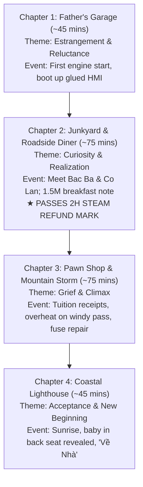

# Narrative & Gameplay Design Pipeline (The Last Waypoint)

This skill serves as the definitive reference for storytelling, quest structure, world layout, and emotional pacing in **The Last Waypoint (Tần Số Cuối Cùng)**. All narrative elements must align strictly with the Single Source of Truth: [SSOT_THE_LAST_WAYPOINT.md](file:///Users/toanlb/toanlb_game/Rearview/Documents/SSOT_THE_LAST_WAYPOINT.md).

---

## 1. Core Vision & The 3-Generation Theme

### Central Theme
> *"Ta chỉ thực sự hiểu được nỗi nhọc nhằn và sự bất toàn của cha mẹ khi chính mình bước vào hành trình làm cha. Sự tha thứ không phải là xóa đi vết thương quá khứ, mà là học cách yêu thương để không lặp lại bi kịch lên thế hệ mai sau."*

### Key Narrative Pillars:
1. **Multi-Perspective Truth (Góc nhìn đa chiều):** The protagonist doesn't just learn about his father from his own memories or old audio tapes; he uncovers the father's life through the lenses of local residents (the scrap yard owner, the roadside diner cook, the pawn shop proprietor).
2. **Breaking the Generational Cycle (Phá vỡ lời nguyền thế hệ):** The journey transforms cynicism and resentment into empathy, enabling the son to overcome his fear of fatherhood.
3. **The Fatherhood Twist (The 3-Generation Payoff):**
   - At the final lighthouse at dawn, the camera reveals: **The protagonist's sleeping child in the backseat under a warm blanket.**
   - The makeshift HMI screen prints:
     ```text
     HANH TRINH CUA BO: HOAN TAT.
     VUI LONG NHAP DICH DEN MOI: [ _____________ ]
     ```
   - The son types: *"Về Nhà"* (Go Home) — beginning his own journey as a father.

---

## 2. Emotional Arc & The 4-Chapter Progression

The game is structured into 4 linear chapters with a target playtime of **3.5 – 5.5 hours** (safely exceeding the 2-hour Steam refund threshold):



### Chapter Breakdown:
- **Chapter 1: Garage Của Bố & Khởi Động Cỗ Máy Cũ (~45 Phút)**
  - *Setting:* Late rainy afternoon. Father's desolate workshop.
  - *Gameplay:* Walk around garage in TPS mode, examine messy workbench. Enter car, start sputtering engine, boot up crude LCD.
  - *Event:* Father's opening code message: *"Chào con. Xe này bố tự đóng, chạy tốt đấy..."*
  - *Objective:* Drive around the block to charge battery and calibrate controls.

- **Chapter 2: Bãi Phế Liệu & Quán Ăn Đêm (~75 Phút)**
  - *Setting:* Midnight coastal fog. HMI loses signal.
  - *Gameplay:*
    - Visit Junkyard: Talk to Bác Ba, search scrap cars for replacement circuit boards.
    - Visit Roadside Diner: Meet Cô Lan in a warm, lit eatery.
  - *Key Reveals:* Father's youthful mistakes, bankruptcy, late remorse. The notebook entry complaining about 1.5 million VND college breakfast fees vs. his own starvation.
  - **CRITICAL MILESTONE:** Reached at ~2 hours of gameplay.

- **Chapter 3: Tiệm Cầm Đồ & Bão Đêm Trên Đèo (~75 Phút)**
  - *Setting:* Severe coastal thunderstorm with lightning.
  - *Gameplay:*
    - Visit Pawn Shop: Talk to Chú Hùng, redeem father's fountain pen.
    - Discover folder `HOC_PHI_DAI_HOC`: 4 years of tuition receipts and father's debt records.
    - High-intensity drive: Engine overheating, electrical failures, player manages fuses while steering through the storm.

- **Chapter 4: Ngọn Hải Đăng & Thiên Chức Làm Cha (~45 Phút)**
  - *Setting:* 05:30 AM. Storm clears, warm sunrise over the cliff.
  - *Gameplay:* Peaceful drive to scenic cliff. No stressful puzzles.
  - *Payoff:* Place father's pen on the dashboard. Camera pans to backseat: Child stirs and smiles. Protagonist enters new destination: *"Về Nhà"*.

---

## 3. Micro-Town Hub-and-Spoke World Structure

To ensure solo-dev feasibility (10–12 months roadmap), the world is **NOT an open-world**. It is a **3–5 km coastal road connecting 4 distinct stopover hubs**:

```text
[GARAGE CỦA BỐ] ──(Lái xe)──► [BÃI PHẾ LIỆU] ──(Lái xe)──► [QUÁN ĂN ĐÊM]
      ▲                                                           │
      │                                                           ▼
(Trở về nâng cấp) ◄───────── (Lái xe) ─────────── [TIỆM CẦM ĐỒ CŨ]
                                                                  │
                                                          (Chuyến đi cuối)
                                                                  ▼
                                                      [NGỌN HẢI ĐĂNG BIỂN]
```

### Hub Rules:
1. **Linear Road Constraint:** The player travels along a guided coastal highway. Blockades, road barriers, or navigation waypoints enforce the route.
2. **Minimalist Interiors:** Shops and diners are NOT full buildings. Only model a cozy counter/corner where the NPC stands (saves 80% environment art budget).
3. **Targeted NPC Count:** Exactly 3 supporting NPCs + 1 recorded voice of the father:
   - **Bác Ba** (Bãi phế liệu - Junkyard)
   - **Cô Lan** (Quán ăn ven đường - Diner)
   - **Chú Hùng** (Tiệm cầm đồ - Pawn Shop)
   - **Người Cha** (Băng cassette & tin nhắn HMI)

---

## 4. Foreshadowing System (The Hidden Clues)

Plant subtle clues throughout Chapters 1–3 that pay off in Chapter 4 without giving away the ending prematurely:

| Clue Type | Manifestation | Player Perception Before Climax | Reality Revealed in Climax |
| :--- | :--- | :--- | :--- |
| **Audio** | Faint, rhythmic breathing when radio is turned off | Ambient wind/cabin creak | The toddler sleeping soundly |
| **HMI Status** | `CABIN_STABILIZER (BABY_MODE): ON` | Father's weird coding quirk | Active suspension damping for baby comfort |
| **Interior Item** | A tiny mismatched sock or baby bottle near the pedals | Father's old trash or clutter | Dropped by the child earlier |
| **Rearview Mirror** | Soft pastel blanket visible in the reflection corner | Luggage or old laundry | The baby's crib blanket |

---

## 5. NPC Interaction & Cinematic Guidelines (Solo-Dev Friendly)

To bypass the "uncanny valley" and eliminate complex facial animation budgets:

1. **Camera Framing:**
   - Use **Over-The-Shoulder (OTS)** or **Medium Wide Shots** via Cinemachine.
   - **NEVER use extreme close-ups on NPC faces.**
2. **Body Language Over Lip-Sync:**
   - Use Mixamo body animations: nodding, leaning on counter, crossing arms, lighting a cigarette.
   - Use basic audio-amplitude lip-flap (e.g. OVRLipSync or simple jaw bone rotation driven by volume).
3. **Voice Acting:**
   - Primary: Professional English voice acting (Fiverr/Voice123 budget ~ $200 for 4 voices).
   - Subtitles: Vietnamese (Full interface & subtitles) + Global localization.

---

## 6. Narrative Verification Checklist

Before finalizing any quest, dialogue script, or level segment, verify:
- [ ] Does this dialogue reinforce the father-son relationship or multi-perspective truth?
- [ ] Is the location confined to the 4 Micro-Town hubs or connecting highway?
- [ ] Does the player experience the dual gameplay loop (Drive -> Stop -> Walk in TPS -> Interact -> Return to car)?
- [ ] Are foreshadowing clues (Baby Mode, soft breathing, mirror reflection) preserved?
- [ ] Does Chapter 2 pacing guarantee > 2 hours of engaging playtime?
