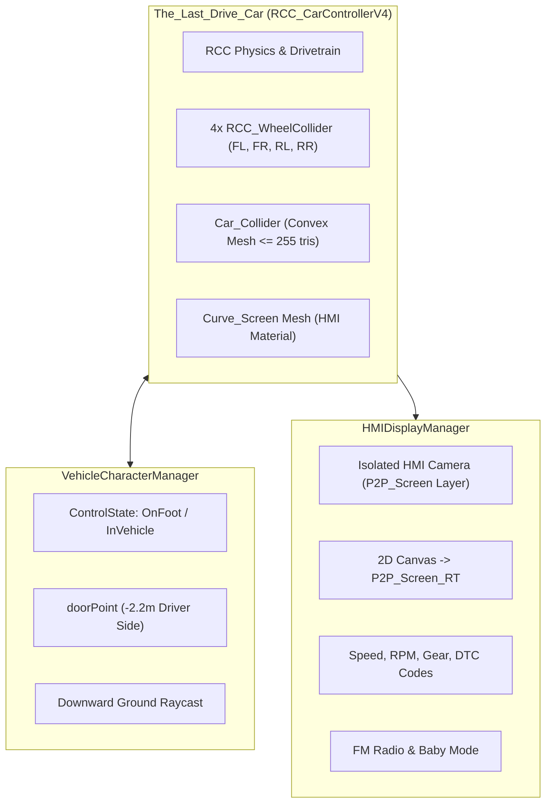

# RCC Vehicle Control & Interaction Pipeline Standards

This skill defines the architectural standards, physics configurations, control handover systems, and in-cabin HMI display integration using **Realistic Car Controller V4 (RCC)** in *The Last Waypoint*.

---

## 1. Overview & RCC Architecture in the Project

The vehicle is the central emotional hub and mechanical gameplay anchor of *The Last Waypoint*. The architecture combines vehicle physics, camera management, seamless enter/exit transitions, and a curved HMI screen with diagnostic telemetry.



Key reference implementations:
- [VehicleCharacterManager.cs](file:///Users/toanlb/toanlb_game/Rearview/Assets/_Rearview/Scripts/VehicleCharacterManager.cs)
- [HMIDisplayManager.cs](file:///Users/toanlb/toanlb_game/Rearview/Assets/_Rearview/Scripts/HMIDisplayManager.cs)
- [blender-unity-vehicle-pipeline](file:///Users/toanlb/toanlb_game/Rearview/.agents/skills/blender-unity-vehicle-pipeline/SKILL.md)

---

## 2. RCC Vehicle Setup & Physics Standards

### 2.1 Vehicle Root & Wheel Hierarchy
- The vehicle root must contain `RCC_CarControllerV4`.
- Exactly 4 `RCC_WheelCollider` components mapped to the 4 separated wheel meshes:
  - `Wheel_FL` (Front Left): Steerable, Drive/Brake
  - `Wheel_FR` (Front Right): Steerable, Drive/Brake
  - `Wheel_RL` (Rear Left): Drive/Brake, Handbrake
  - `Wheel_RR` (Rear Right): Drive/Brake, Handbrake
- Wheel origins must be centered at `(0, 0, 0)` in their local space.

### 2.2 Physics Materials
Use project-standard physics materials:
- Asphalt / Road: `Assets/RealisticCarControllerV4/Physics Materials/RCC_AsphaltPhysics.physicMaterial`
- Dirt / Offroad: `Assets/RealisticCarControllerV4/Physics Materials/RCC_TerrainPhysics.physicMaterial`
- Chassis/Bumper Collider: `Assets/RealisticCarControllerV4/Physics Materials/RCC_VehicleCollider.physicMaterial`

### 2.3 Convex Collision Hull Limit
- The chassis collider (`Car_Collider`) MUST be a convex mesh with **<= 255 triangles** to comply with Unity PhysX cooking limits.

---

## 3. Control Handover System (Enter / Exit Mechanics)

Managed by [VehicleCharacterManager.cs](file:///Users/toanlb/toanlb_game/Rearview/Assets/_Rearview/Scripts/VehicleCharacterManager.cs):

### 3.1 Entering the Vehicle (OnFoot -> InVehicle)
When the player presses `[E]` within `interactionDistance` (3.5m) of the driver's door:
1. **Disable Character:** `character.SetActive(false)` — disables player physics, input, and animators.
2. **Disable HAP Camera Rig:** `hapCameraRig.SetActive(false)` — deactivates CinemachineBrain and on-foot AudioListener.
3. **Enable RCC Camera:**
   ```csharp
   rccCamera.isRendering = true;
   if (rccCamera.actualCamera)
   {
       rccCamera.actualCamera.gameObject.SetActive(true);
       var listener = rccCamera.actualCamera.GetComponent<AudioListener>();
       if (listener) listener.enabled = true;
   }
   rccCamera.SetTarget(carController);
   ```
4. **Enable Car Control & Engine:**
   ```csharp
   carController.SetCanControl(true);
   carController.handbrakeInput = 0f;
   carController.StartEngine();
   ```

### 3.2 Exiting the Vehicle (InVehicle -> OnFoot)
When the player presses `[E]` while driving:
1. **Calculate Safe Exit Position:**
   - Default position: `carController.transform.TransformPoint(new Vector3(-2.2f, 0f, 0f))`.
   - **Ground Raycast Alignment (CRITICAL):**
     ```csharp
     if (Physics.Raycast(exitPos + Vector3.up * 2.5f, Vector3.down, out RaycastHit hit, 10f))
     {
         exitPos.y = hit.point.y;
     }
     character.transform.position = exitPos;
     character.transform.rotation = Quaternion.Euler(0f, carController.transform.eulerAngles.y, 0f);
     ```
2. **Enable Character & HAP Camera:**
   - `character.SetActive(true)`
   - `hapCameraRig.SetActive(true)`
3. **Disable RCC Camera & Car AudioListener:**
   ```csharp
   rccCamera.isRendering = false;
   if (rccCamera.actualCamera)
   {
       rccCamera.actualCamera.gameObject.SetActive(false);
       var listener = rccCamera.actualCamera.GetComponent<AudioListener>();
       if (listener) listener.enabled = false;
   }
   ```
4. **Lock Car Control:**
   ```csharp
   carController.SetCanControl(false);
   carController.handbrakeInput = 1f;
   carController.KillEngine();
   ```

---

## 4. In-Vehicle Curved HMI Display & Telemetry

Managed by [HMIDisplayManager.cs](file:///Users/toanlb/toanlb_game/Rearview/Assets/_Rearview/Scripts/HMIDisplayManager.cs):

### 4.1 Rendering Setup
- A dedicated 2D Canvas is placed on the isolated `P2P_Screen` layer.
- An orthographic camera renders the Canvas directly into `P2P_Screen_RT.renderTexture`.
- The RenderTexture is assigned to the `Curve_Screen` mesh material (`plasticGlossy.001`).

### 4.2 Telemetry & Diagnostic DTC Codes
- **Driver Cluster:** Real-time extraction of `carController.speed`, `carController.engineRPM`, `carController.currentGear`.
- **Diagnostic Trouble Codes (DTC):**
  - Used for vehicle repair and quest gating:
    - `DTC: NO FAULT CODES DETECTED`
    - `DTC: P0118 - CẢM BIẾN NHIỆT ĐỘ NƯỚC LÀM MÁT (CHẬP)`
    - `DTC: P0300 - BỎ ĐÁNH LỬA ĐA XY-LANH (BUGI CŨ)`
    - `DTC: P0420 - HIỆU SUẤT BẦU LỌC KHÍ THẢI KÉM`
- **Infotainment & Radio:**
  - `FM 94.5 MHz - Coastal Waves (Mưa Đêm)`
  - `FM 88.9 MHz - Father's Tape: Lời Nhắn Của Bố (1998)`
- **Foreshadowing Indicator:**
  - Status display: `CABIN_STABILIZER (BABY_MODE): ON`

---

## 5. AudioListener & Conflict Prevention

> [!CAUTION]
> Unity will throw constant console warnings and produce distorted audio if multiple `AudioListener` components are enabled at the same time.
> - When `ControlState.OnFoot`: Character / Cinemachine camera AudioListener is **ENABLED**, RCC camera AudioListener is **DISABLED**.
> - When `ControlState.InVehicle`: RCC camera AudioListener is **ENABLED**, Character / Cinemachine AudioListener is **DISABLED**.

---

## 6. RCC Verification Checklist

Before testing a scene or vehicle modification:
- [ ] Vehicle root has `RCC_CarControllerV4` with 4 assigned `RCC_WheelCollider` components.
- [ ] `Car_Collider` exists with convex mesh <= 255 triangles.
- [ ] Driver door point is set on the left side (`X ≈ -2.2m`).
- [ ] Pressing `[E]` near vehicle enters car; pressing `[E]` inside exits car.
- [ ] Character does not fall through ground when exiting (Ground Raycast working).
- [ ] Only 1 `AudioListener` is active in the scene at any time.
- [ ] HMI screen displays speed, RPM, radio stations, and DTC codes correctly.
