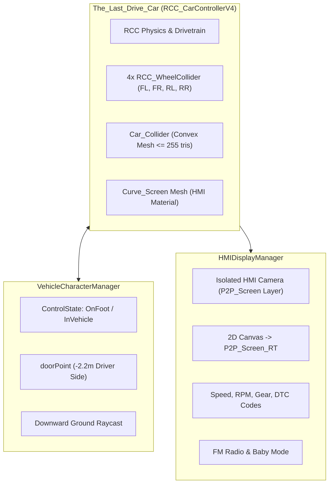

# RCC Vehicle Control & Interaction Pipeline Standards

This skill defines the architectural standards, physics configurations, control handover systems, and in-cabin HMI display integration using **Realistic Car Controller V4 (RCC)** in *The Last Waypoint*.

---

## 1. Overview & RCC Architecture in the Project

The vehicle is the central emotional hub and mechanical gameplay anchor of *The Last Waypoint*. The architecture combines vehicle physics, camera management, seamless enter/exit transitions, and a curved HMI screen with diagnostic telemetry.



Key reference implementations:
- [VehicleCharacterManager.cs](file:///Users/toanlb/toanlb_game/Rearview/Assets/_Rearview/Scripts/VehicleCharacterManager.cs)
- [HMIDisplayManager.cs](file:///Users/toanlb/toanlb_game/Rearview/Assets/_Rearview/Scripts/HMIDisplayManager.cs)
- [blender-unity-vehicle-pipeline](file:///Users/toanlb/toanlb_game/Rearview/.agents/skills/blender-unity-vehicle-pipeline/SKILL.md)

---

## 2. RCC Vehicle Setup & Physics Standards

### 2.1 Vehicle Root & Wheel Hierarchy
- The vehicle root must contain `RCC_CarControllerV4`.
- Exactly 4 `RCC_WheelCollider` components mapped to the 4 separated wheel meshes:
  - `Wheel_FL` (Front Left): Steerable, Drive/Brake
  - `Wheel_FR` (Front Right): Steerable, Drive/Brake
  - `Wheel_RL` (Rear Left): Drive/Brake, Handbrake
  - `Wheel_RR` (Rear Right): Drive/Brake, Handbrake
- Wheel origins must be centered at `(0, 0, 0)` in their local space.

### 2.2 Physics Materials
Use project-standard physics materials:
- Asphalt / Road: `Assets/RealisticCarControllerV4/Physics Materials/RCC_AsphaltPhysics.physicMaterial`
- Dirt / Offroad: `Assets/RealisticCarControllerV4/Physics Materials/RCC_TerrainPhysics.physicMaterial`
- Chassis/Bumper Collider: `Assets/RealisticCarControllerV4/Physics Materials/RCC_VehicleCollider.physicMaterial`

### 2.3 Convex Collision Hull Limit
- The chassis collider (`Car_Collider`) MUST be a convex mesh with **<= 255 triangles** to comply with Unity PhysX cooking limits. Alternatively, a single `BoxCollider` on the chassis container (`The_Last_Drive_Car`) may be used.

### 2.4 Compound Collider & Visual Mesh Protection (Zero-Child-Collider Rule)
- **The Compound Collider Trap:** In Unity PhysX, any collider attached to any child of a dynamic Rigidbody becomes part of the vehicle's compound collider.
- **Visual Meshes:** All visual body meshes, doors, glass, screens, seats, and wheels under `The_Last_Drive_Car` **MUST NEVER HAVE ANY COLLIDER ATTACHED**.
- **Wheel Overlap Warning:** If a child visual mesh has a collider and intersects the suspension or sweep of an `RCC_WheelCollider`, the wheel raycast will hit the vehicle's own body, causing catastrophic physics failures (violent oscillations, vehicle launching into the sky, or getting stuck).
- **Layer Isolation:**
  - Car Root & Visual Meshes: Layer `8` (`RCC_Vehicle`).
  - Wheel Colliders: Layer `9` (`RCC_WheelCollider`).
  - Screens: Layer `31` (`P2P_Screen`).
  - Layer `9` is configured in Unity Physics Matrix to NEVER collide with Layer `8`.
- See [vehicle-mesh-modification-pipeline](../vehicle-mesh-modification-pipeline/SKILL.md) and `VehicleMeshSyncTool.cs` for automated validation and collider cleaning.

---


## 3. Control Handover System (Enter / Exit Mechanics)

Managed by [VehicleCharacterManager.cs](file:///Users/toanlb/toanlb_game/Rearview/Assets/_Rearview/Scripts/VehicleCharacterManager.cs):

### 3.1 Entering the Vehicle (OnFoot -> InVehicle)
When the player presses `[E]` within `interactionDistance` (3.5m) of the driver's door:
1. **Disable Character:** `character.SetActive(false)` — disables player physics, input, and animators.
2. **Disable HAP Camera Rig:** `hapCameraRig.SetActive(false)` — deactivates CinemachineBrain and on-foot AudioListener.
3. **Enable RCC Camera:**
   ```csharp
   rccCamera.isRendering = true;
   if (rccCamera.actualCamera)
   {
       rccCamera.actualCamera.gameObject.SetActive(true);
       var listener = rccCamera.actualCamera.GetComponent<AudioListener>();
       if (listener) listener.enabled = true;
   }
   rccCamera.SetTarget(carController);
   ```
4. **Enable Car Control & Engine:**
   ```csharp
   carController.SetCanControl(true);
   carController.handbrakeInput = 0f;
   carController.StartEngine();
   ```

### 3.2 Exiting the Vehicle (InVehicle -> OnFoot)
When the player presses `[E]` while driving:
1. **Calculate Safe Exit Position:**
   - Default position: `carController.transform.TransformPoint(new Vector3(-2.2f, 0f, 0f))`.
   - **Ground Raycast Alignment (CRITICAL):**
     ```csharp
     if (Physics.Raycast(exitPos + Vector3.up * 2.5f, Vector3.down, out RaycastHit hit, 10f))
     {
         exitPos.y = hit.point.y;
     }
     character.transform.position = exitPos;
     character.transform.rotation = Quaternion.Euler(0f, carController.transform.eulerAngles.y, 0f);
     ```
2. **Enable Character & HAP Camera:**
   - `character.SetActive(true)`
   - `hapCameraRig.SetActive(true)`
3. **Disable RCC Camera & Car AudioListener:**
   ```csharp
   rccCamera.isRendering = false;
   if (rccCamera.actualCamera)
   {
       rccCamera.actualCamera.gameObject.SetActive(false);
       var listener = rccCamera.actualCamera.GetComponent<AudioListener>();
       if (listener) listener.enabled = false;
   }
   ```
4. **Lock Car Control:**
   ```csharp
   carController.SetCanControl(false);
   carController.handbrakeInput = 1f;
   carController.KillEngine();
   ```

---

## 4. In-Vehicle Curved HMI Display & AAOS Architecture

Managed by [HMIDisplayManager.cs](file:///Users/toanlb/toanlb_game/Rearview/Assets/_Rearview/Scripts/HMIDisplayManager.cs):

### 4.1 Rendering Setup & Screen Decoupling
- A dedicated 2D Canvas is placed on the isolated `P2P_Screen` layer at `(0, -500, 0)`.
- An orthographic camera renders the Canvas directly into `P2P_Screen_RT.renderTexture` (1920x320).
- The RenderTexture is assigned to the `Curve_Screen` mesh material (`plasticGlossy.001` with `_EMISSION` enabled).
- **Zero-Collider Rule:** `Curve_Screen` is strictly a visual display mesh and MUST NOT have any colliders attached, preserving clean PhysX compound bounds for the vehicle's dynamic Rigidbody.
- **HVAC Screen Decoupling:** The lower console `HVAC_Screen` is assigned `HVAC_Screen_Off.mat` (non-emissive dark glass) to ensure it remains dark and does not mirror the upper P2P screen.

### 4.2 Unobstructed Driver Cluster (Left 48%)
- **Steering Wheel Opening (X: 0.42 to 0.78, Y: 0.40 to 0.76):**
  - Primary Speedometer (large bold digits), `KM/H` unit label, and `GEAR` (`D1`, `P`, `R`, `N`) framed right inside the upper steering wheel opening.
- **Unobstructed Left Area (X: 0.03 to 0.38):**
  - Completely visible to the left of the steering wheel: RPM text & dynamic horizontal RPM bar, engine coolant `TEMP`, battery voltage `BAT`, and diagnostic `DTC` fault codes.

### 4.3 Center AAOS Infotainment (Right 50%)
Modeled after **Android Automotive OS (AAOS)** with App Launcher Grid and 4 Fullscreen App screens:
- **Top System Bar:** Real-time clock, coastal weather (`16°C Mưa Đêm`), GPS/Network status badges, and `[ ⊞ APPS (1) ]` Home shortcut.
- **State 0: App Launcher Grid (Default Home):**
  - 4 interactive cards with icons and labels: `[2] 🧭 BẢN ĐỒ`, `[3] 📻 RADIO FM`, `[4] 🔧 CHẨN ĐOÁN DTC`, `[5] ⚙️ CÀI ĐẶT CABIN`.
  - Selecting any card opens that specific app screen full-size on the center display.
- **Fullscreen App Screens:**
  - `[2] NAV`: Satellite navigation, route guidance, distance/ETA, road conditions, and Father's handwritten DIY note.
  - `[3] MEDIA`: FM Radio tuner (`94.5 MHz`, `88.9 MHz Father's Tape 1998`), 12-bar dynamic equalizer visualizer, track info, Prev/Next channel buttons.
  - `[4] DTC`: OBD-II Diagnostics, live coolant temp/battery/RPM gauges, DTC fault code scanner (`P0118`, `P0300`, `P0420`), severity badges, and Scan button.
  - `[5] CABIN`: Cabin controls & `CABIN_STABILIZER (BABY_MODE)` toggle for suspension softening to keep the sleeping baby undisturbed in the rear seat.
- **Navigation & Controls:**
  - Each app screen contains a prominent `[ ◀ LAUNCHER (1) ]` button to return to the App Grid.
  - Fast hotkeys: `[1]` or `[ESC]` for Launcher, `[2]` Nav, `[3]` Radio, `[4]` DTC, `[5]` Cabin, `[Tab]` to cycle apps, `[Q]`/`[E]` for radio stations, `[R]` to scan DTC, and `[B]` to toggle Baby Mode.

---

## 5. AudioListener & Conflict Prevention

> [!CAUTION]
> Unity will throw constant console warnings and produce distorted audio if multiple `AudioListener` components are enabled at the same time.
> - When `ControlState.OnFoot`: Character / Cinemachine camera AudioListener is **ENABLED**, RCC camera AudioListener is **DISABLED**.
> - When `ControlState.InVehicle`: RCC camera AudioListener is **ENABLED**, Character / Cinemachine AudioListener is **DISABLED**.

---

## 6. RCC Verification Checklist

Before testing a scene or vehicle modification:
- [ ] Vehicle root has `RCC_CarControllerV4` with 4 assigned `RCC_WheelCollider` components.
- [ ] `Car_Collider` exists with convex mesh <= 255 triangles (or BoxCollider on `The_Last_Drive_Car`).
- [ ] **Zero-Child-Collider Rule verified:** No visual mesh under `The_Last_Drive_Car` has a `Collider` attached.
- [ ] Layer isolation verified: Car root/visuals on Layer 8 (`RCC_Vehicle`), WheelColliders on Layer 9 (`RCC_WheelCollider`), Screens on Layer 31 (`P2P_Screen`).
- [ ] Driver door point is set on the left side (`X ≈ -2.2m`).
- [ ] Pressing `[E]` near vehicle enters car; pressing `[E]` inside exits car.
- [ ] Character does not fall through ground when exiting (Ground Raycast working).
- [ ] Only 1 `AudioListener` is active in the scene at any time.
- [ ] HMI screen displays speed, RPM, radio stations, and DTC codes correctly.

