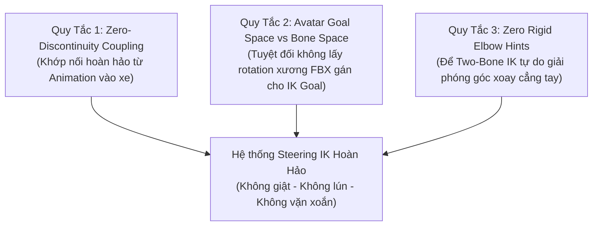

# Vehicle Cockpit & Steering Wheel IK Pipeline

Quy chuẩn kỹ thuật chuẩn hóa quy trình **gắn kết, điều khiển và đồng bộ cử động hai bàn tay của nhân vật Humanoid 3D theo vô lăng xe** bằng hệ thống **Malbers Animations Horse AnimSet Pro (HAP) IKManager** kết hợp với **Unity Mecanim Avatar IK** và **Realistic Car Controller V4 (RCC)** trong dự án *The Last Waypoint*.

---

## 1. Bối cảnh & Tầm quan trọng kiến trúc

Trong *The Last Waypoint*, buồng lái ô tô (Cockpit) là không gian tương tác cốt lõi nhất của gameplay góc nhìn thứ nhất (FPS Cabin View) và thứ ba (TPS).
Khi lái xe:
- Vô lăng xoay liên tục quanh trục cột lái khi người chơi nhấn `A` / `D` hoặc điều khiển vô lăng.
- Hai bàn tay của nhân vật bắt buộc phải nắm chắc trên vành vô lăng, chuyển động xoay tròn tự nhiên theo vành, cổ tay uốn lượn nhịp nhàng và cẳng tay co duỗi mượt mà.
- **Thách thức lớn nhất:** Nhân vật hiện tại là model tạm thời (`Player_YBot` từ Mixamo). Khi dự án bước vào giai đoạn hoàn thiện, nhân vật chính thức sẽ có tỷ lệ cơ thể khác (chiều dài sải tay, độ rộng vai, kích thước bàn tay) và cấu trúc bone FBX khác.
- Nếu không tuân thủ các quy tắc trong skill này, việc đổi nhân vật sẽ lập tức gây ra các biến dạng nghiêm trọng: vặn gãy cổ tay 90°–180°, bàn tay thụt lùi chìm vào còi xe, hoặc cẳng tay bị gập xoắn vào ngực.

---

## 2. Ba Quy Tắc Vàng của Cockpit IK (The Three Golden Rules)



### Quy Tắc 1: Khớp nối hoàn hảo (Zero-Discontinuity Coupling)
- Animation vào xe (`Y_Bot@Entering_Car.fbx`) kết thúc ở frame cuối khi nhân vật đã ngồi vững vào ghế lái và hai bàn tay đang đặt tự nhiên trên vành vô lăng.
- **Yêu cầu:** Tại thời điểm vô lăng ở vị trí thẳng (neutral, $\text{steerAngle} = 0$), vị trí và hướng xoay của hai điểm neo IK (`HandTarget_L`, `HandTarget_R`) bắt buộc phải trùng khớp **100.000%** với tư thế tay của animation gốc. Không được phép có độ giật, lệch vị trí hay trễ dù chỉ 1 frame.

### Quy Tắc 2: Mecanim Avatar Goal Space vs Raw Bone Transform Space
> [!CAUTION]
> **NGUYÊN NHÂN GÂY LỖI GÃY CỔ TAY / XOAY 90° - 180° VÀO TRONG NGỰC:**
>
> 1. **Lệch hệ trục tọa độ:**
>    - Xương cổ tay trong file FBX (Mixamo, Blender) thường có trục cục bộ riêng: Trục **+X** chỉ dọc theo các ngón tay.
>    - Nhưng hàm `animator.SetIKRotation(AvatarIKGoal.LeftHand, rotation)` của Unity Mecanim lại hoạt động trong **Mecanim Avatar IK Goal Space**: Trục **+Z** mới là hướng ngón tay, Trục **+Y** là pháp tuyến mu bàn tay, Trục **+X** là cạnh bàn tay.
>    - Nếu lấy `anim.GetBoneTransform(HumanBodyBones.LeftHand).rotation` gán cho `HandTarget_L.rotation`, bộ giải IK sẽ nhầm trục ngón tay với cạnh bàn tay $\rightarrow$ **bẻ gãy cổ tay 90°–180° ngược vào trong ngực!**
> 2. **Lệch điểm tiếp xúc (Wrist Joint vs Palm Grip Goal):**
>    - `GetBoneTransform(HumanBodyBones.LeftHand).position` trả về vị trí của **khớp cổ tay** (gốc bàn tay).
>    - `AvatarIKGoal.LeftHand` đại diện cho **tâm lòng bàn tay** (điểm nắm giữ vật phẩm).
>    - Gán IK Goal bằng vị trí khớp cổ tay sẽ kéo toàn bộ bàn tay lùi về sau ~10–12 cm, khiến bàn tay bị tụt thẳng từ vành trên (góc 10h) xuống vành dưới (góc 7:30) và chìm vào trong vô lăng!
>
> **GIẢI PHÁP CHUẨN:** Bắt buộc sử dụng component [`VehicleSteeringIKHook`](file:///Users/toanlb/toanlb_game/Rearview/Assets/_Rearview/Scripts/VehicleCharacterManager.cs) để đọc `anim.GetIKPosition(AvatarIKGoal.LeftHand)` và `anim.GetIKRotation(AvatarIKGoal.LeftHand)` trực tiếp trong callback `OnAnimatorIK`. Đây là API duy nhất của Unity trả về đúng Avatar Goal Space chuẩn hóa của Mecanim.

### Quy Tắc 3: Không Dùng Điểm Neo Khuỷu Tay Cứng (Zero Rigid Elbow Hints)
- Không gắn `HumanIKHint` vào các vị trí cố định trên thân xe khi đang lái.
- Bộ giải Humanoid Two-Bone IK của Unity khi đã có vị trí và góc xoay chính xác của bàn tay sẽ tự động xác định mặt phẳng uốn cong của cẳng tay và góc mở khuỷu tay theo tam giác `Vai -> Khuỷu tay -> Cổ tay`.
- Việc ép khuỷu tay vào một điểm hint tĩnh trong không gian xe khi vô lăng đang quay sẽ gây xung đột ràng buộc, bẻ gãy cẳng tay thành góc nhọn dị dạng.

---

## 3. Hình học Vô lăng & Tọa độ Điểm Neo Cầm Nắm

### 3.1 Cấu trúc Hình học Vô lăng (The_Last_Drive_Car)
- **Kích thước vô lăng:** Rộng $33.15\text{ cm}$, Cao $32.03\text{ cm}$, Độ dày $12.31\text{ cm}$.
- **Bán kính ngoài:** $R \approx 0.165\text{ m}$ ($16.5\text{ cm}$).
- **Bán kính cầm nắm (Rim Centerline):** $R_{\text{grip}} \approx 0.14\text{ m} - 0.15\text{ m}$.
- **Góc nghiêng cột lái:** Nghiêng $20^\circ$ quanh trục local X (`localRotation = Quaternion.Euler(20, 0, 0)`).
- **Trục xoay lái của RCC:** Xoay quanh trục local Z (`Vector3.forward`).

```
                [12:00] (y = +0.15)
                 /-----\
     (10:00) L  /       \  R (02:00)
    HandTarget_L|   (+)   | HandTarget_R
                \       /
                 \-----/
                [06:00] (y = -0.15)
```

### 3.2 Tọa độ Fallback Vị trí Cầm 10 Giờ và 2 Giờ (Local to Steering_Wheel)
Khi khởi động trực tiếp trong xe hoặc trước khi calibration động hoàn tất, hai điểm neo phải có giá trị fallback an toàn:

| Điểm neo | `localPosition` | `localEulerAngles` | Quaternion | Vị trí thực tế |
| :--- | :--- | :--- | :--- | :--- |
| **`HandTarget_L`** | `(-0.135, 0.085, 0.015)` | `(-15, 25, -50)` | `(-0.206, 0.141, -0.383, 0.889)` | Vành trên bên trái (Góc 10 giờ) |
| **`HandTarget_R`** | `(0.135, 0.085, 0.015)` | `(-15, -25, 50)` | `(-0.206, -0.141, 0.383, 0.889)` | Vành trên bên phải (Góc 2 giờ) |

### 3.3 Phân cấp Cây Đối tượng (Transform Hierarchy)
Bắt buộc tuân thủ đúng phân cấp để đảm bảo tính toán vi tích phân quay tự động:
```
The_Last_Drive_Car (RCC_CarControllerV4)
└── The_Last_Drive_Car (Mesh Root)
    └── Steering_Wheel (Transform xoay bởi RCC)
        ├── HandTarget_L (Child Transform, 0 Colliders)
        └── HandTarget_R (Child Transform, 0 Colliders)
```
> [!IMPORTANT]
> **Quy tắc Zero-Child-Collider:**
> Tuyệt đối không được gắn bất kỳ `Collider` hay `Rigidbody` nào trên `HandTarget_L` và `HandTarget_R` để bảo vệ compound collider của PhysX trên thân xe.

---

## 4. Kiến trúc HAP `IKManager` cho Vô Lăng

### 4.1 Cấu hình IKSet "Steering"
Trên component [`IKManager`](file:///Users/toanlb/toanlb_game/Rearview/Assets/Malbers%20Animations/Common/Scripts/IK/IKManager.cs) của nhân vật:

```csharp
var steeringSet = new IKSet()
{
    name = new StringReference("Steering") { UseConstant = true },
    active = false,          // Bật khi vào xe, tắt khi xuống xe
    Weight = 1f,
    EnableTime = 0.05f,      // Bật nhanh để bám tay tức thì
    DisableTime = 0.1f,
    LerpWeight = 0f,         // 100% full weight coupling
    Targets = new TransformReference[2]
    {
        handTargetLeft,      // Index 0 -> Left Hand
        handTargetRight      // Index 1 -> Right Hand
    },
    IKProcesors = new List<IKProcessor>()
    {
        new HumanIKGoal()
        {
            name = "Left Hand Steering Goal",
            Active = true,
            Weight = 1f,
            goal = AvatarIKGoal.LeftHand,
            TargetIndex = 0,
            position = true,
            rotation = true,
            OffsetP = Vector3.zero,
            OffsetR = Vector3.zero
        },
        new HumanIKGoal()
        {
            name = "Right Hand Steering Goal",
            Active = true,
            Weight = 1f,
            goal = AvatarIKGoal.RightHand,
            TargetIndex = 1,
            position = true,
            rotation = true,
            OffsetP = Vector3.zero,
            OffsetR = Vector3.zero
        }
    }
};
```

### 4.2 PlayableGraph IK Pass Integration
Khi animation vào xe được phát qua PlayableGraph trong [`VehicleCharacterManager.cs`](file:///Users/toanlb/toanlb_game/Rearview/Assets/_Rearview/Scripts/VehicleCharacterManager.cs):
```csharp
clipPlayable = AnimationClipPlayable.Create(activePlayableGraph, enterCarClip);
clipPlayable.SetApplyPlayableIK(true); // BẮT BUỘC: Cho phép PlayableGraph kích hoạt OnAnimatorIK
clipPlayable.SetApplyFootIK(false);
```

---

## 5. Cơ Chế Calibration Động: `VehicleSteeringIKHook`

Component [`VehicleSteeringIKHook`](file:///Users/toanlb/toanlb_game/Rearview/Assets/_Rearview/Scripts/VehicleCharacterManager.cs) được gắn trực tiếp trên GameObject có component `Animator` của nhân vật:

```csharp
[DefaultExecutionOrder(50)]
public class VehicleSteeringIKHook : MonoBehaviour
{
    private Animator anim;
    private bool isCalibrating = false;
    private Transform targetL;
    private Transform targetR;
    private Action onComplete;

    public void CalibrateSteeringTargets(Transform leftTarget, Transform rightTarget, Action callback = null)
    {
        if (anim == null) anim = GetComponent<Animator>();
        targetL = leftTarget;
        targetR = rightTarget;
        onComplete = callback;
        isCalibrating = true;
    }

    private void OnAnimatorIK(int layerIndex)
    {
        if (!isCalibrating) return;
        if (anim == null || targetL == null || targetR == null)
        {
            isCalibrating = false;
            return;
        }

        // Đọc trực tiếp tọa độ Mecanim Avatar IK Goal chuẩn hóa từ frame lái xe
        Vector3 leftPos = anim.GetIKPosition(AvatarIKGoal.LeftHand);
        Quaternion leftRot = anim.GetIKRotation(AvatarIKGoal.LeftHand);
        Vector3 rightPos = anim.GetIKPosition(AvatarIKGoal.RightHand);
        Quaternion rightRot = anim.GetIKRotation(AvatarIKGoal.RightHand);

        if (leftPos != Vector3.zero && rightPos != Vector3.zero)
        {
            targetL.position = leftPos;
            targetL.rotation = leftRot;
            targetR.position = rightPos;
            targetR.rotation = rightRot;
        }

        isCalibrating = false;
        var cb = onComplete;
        onComplete = null;
        cb?.Invoke();
    }
}
```

---

## 6. Quy Trình 5 Bước Gắn Xe Cho Nhân Vật Mới (Standard Operating Procedure)

Khi thay thế model `Y_Bot` bằng một nhân vật Humanoid 3D mới (ví dụ: `Player_MainHero.fbx`):

### Bước 1: Kiểm tra Rig Humanoid của Model Mới
- Chọn file FBX trong Project $\rightarrow$ Tab **Rig** $\rightarrow$ Animation Type: `Humanoid` $\rightarrow$ Avatar Definition: `Create From This Model`.
- Bấm **Configure...** và kiểm tra các bone:
  - Bắt buộc phải có đủ: `LeftHand`, `RightHand`, `LeftLowerArm`, `RightLowerArm`, `LeftUpperArm`, `RightUpperArm`.
  - Kiểm tra xem bàn tay có ở trạng thái xòe tự nhiên (T-pose) không có xương con bị gãy trục.

### Bước 2: Thực hiện Clone & Swap theo `character-update-pipeline`
- Áp dụng kỹ thuật Clone & Swap từ [`character-update-pipeline`](file:///Users/toanlb/toanlb_game/Rearview/.agents/skills/character-update-pipeline/SKILL.md) để giữ lại trọn vẹn 15 root components của HAP (`MAnimal`, `IKManager`, `MInputLink`,...).

### Bước 3: Đảm bảo Hook & Setup IK Vô Lăng
- Chạy Menu: **`Rearview -> Setup HAP Steering IK`** (từ [`VehicleHAPIKSetup.cs`](file:///Users/toanlb/toanlb_game/Rearview/Assets/_Rearview/Editor/VehicleHAPIKSetup.cs)).
- Tool sẽ tự động:
  1. Gắn component `VehicleSteeringIKHook` lên root của nhân vật mới.
  2. Khởi tạo `IKSet "Steering"` với 2 `HumanIKGoal` (LeftHand & RightHand).
  3. Tắt toàn bộ `HumanIKHint` để tránh xung đột khuỷu tay.
  4. Lưu đồng bộ vào Prefab của nhân vật mới.

### Bước 4: Kiểm tra Ergonomics Ghế Lái & Chiều Dài Cánh Tay
- Nếu nhân vật mới có sải tay ngắn hơn hoặc dài hơn đáng kể so với `Y_Bot`:
  - Trong [`VehicleCharacterManager`](file:///Users/toanlb/toanlb_game/Rearview/Assets/_Rearview/Scripts/VehicleCharacterManager.cs), kiểm tra `startOffsetFromSeat`:
    - `X = -1.86f`: Khoảng cách bước từ cửa vào ghế.
    - `Z = -0.00265f`: Trục dọc tiến/lùi của hông nhân vật so với tựa lưng ghế lái (`FrontSeat_Left`).
  - Đảm bảo khi nhân vật ngồi vào ghế lái, ngực cách vô lăng khoảng $30\text{ cm} - 40\text{ cm}$ để cánh tay có độ cong tự nhiên ($120^\circ - 150^\circ$), không bị duỗi thẳng tắp hay co rúm.

### Bước 5: Kiểm Thử Chức Năng (Play Mode Testing)
1. **Kiểm tra vào xe ([E]):** Quan sát chuyển động vào xe. Khi cửa đóng lại, tay nhân vật phải bám êm ái lên vô lăng ở góc 10h và 2h mà không có bất kỳ cú giật hình hay vặn xoắn cổ tay nào.
2. **Kiểm tra bẻ lái ([A]/[D]):**
   - Đánh hết lái sang trái: Vô lăng quay ngược chiều kim đồng hồ, tay trái hạ thấp dọc vành, tay phải nâng cao qua đỉnh vành. Cổ tay xoay mượt mà theo vành.
   - Đánh hết lái sang phải: Vô lăng quay cùng chiều kim đồng hồ, tay phải hạ thấp, tay trái nâng cao.
   - Nhả phím: Vô lăng trả về tâm, hai bàn tay quay về đúng tư thế neutral hoàn hảo.
3. **Kiểm tra xuống xe ([E]):** Nhấn `E` khi xe dừng hẳn. IK vô lăng phải lập tức ngắt (`DisableSteeringIK`), animation mở cửa bước ra diễn ra trơn tru và chuyển mượt về HAP Idle.

---

## 7. Bảng Tra Cứu Lỗi Thường Gặp (Troubleshooting Matrix)

| Hiện tượng lỗi (Symptom) | Nguyên nhân gốc rễ (Root Cause) | Cách khắc phục ngay (Immediate Fix) |
| :--- | :--- | :--- |
| **Cổ tay vẹo 90° - 180°, ngón tay đâm ngược vào ngực** | Lấy rotation của bone FBX (Mixamo/Blender) gán trực tiếp vào `AvatarIKGoal`. | Dùng `VehicleSteeringIKHook` để đọc `anim.GetIKRotation(AvatarIKGoal.LeftHand)` trong `OnAnimatorIK`. |
| **Bàn tay tụt xuống góc 7:30, chìm vào còi xe** | Lấy vị trí khớp cổ tay (`HumanBodyBones.LeftHand`) gán cho IK Goal thay vì tâm lòng bàn tay; hoặc bị kéo bởi `HumanIKHint`. | Lấy Goal từ `anim.GetIKPosition()`; tắt toàn bộ `HumanIKHint` trong `IKSet "Steering"`. |
| **Vô lăng quay nhưng hai bàn tay đứng yên** | `HandTarget_L` và `HandTarget_R` không phải là con của `Steering_Wheel`, hoặc `IKSet "Steering"` chưa kích hoạt (`Weight = 0`). | Kéo 2 targets làm con trực tiếp của `Steering_Wheel`; kiểm tra `EnableSteeringIK()` đã được gọi. |
| **Bàn tay bị giật mạnh khi vừa ngồi vào ghế** | `EnableSteeringIK()` được gọi trước khi PlayableGraph kết thúc animation hoặc khi vô lăng đang bị lệch góc. | Đợi frame cuối animation hoàn tất, đặt `steeringWheel.localRotation = neutral`, chạy calibration rồi mới bật IK. |
| **Cẳng tay gập gãy thành hình chữ V nhọn** | `Left Elbow Hint` hoặc `Right Elbow Hint` đang ở trạng thái `Active = true` và neo vào điểm tĩnh trên thân xe. | Mở `IKManager` $\rightarrow$ `IKSet "Steering"` $\rightarrow$ Tắt `Active` của cả 2 `HumanIKHint`. |
| **Xe bị nảy tưng bừng hoặc lộn nhào khi nhân vật vào xe** | Vi phạm quy tắc **Zero-Child-Collider**: GameObject nhân vật hoặc `HandTarget` có `Collider` chạm vào xe. | Đảm bảo `SetCharacterCollidersEnabled(false)` được gọi ngay khi vào xe; `StripColliders` trên mọi target con. |
