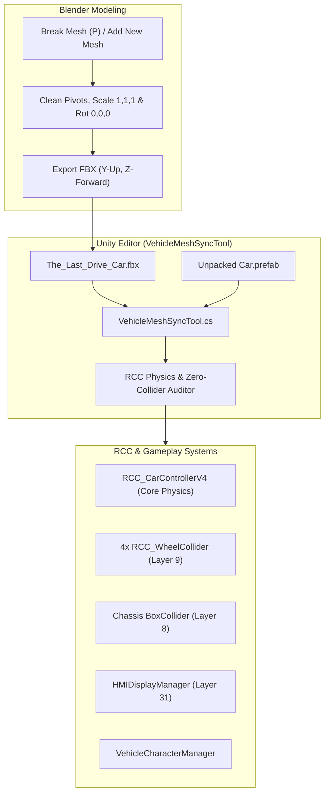

# Vehicle Mesh Modification & Prefab Synchronization Pipeline

This skill defines the mandatory standard operating procedures (SOP), coordinate rules, automated synchronization protocols, and physics protection laws when **modifying vehicle 3D models** (breaking meshes, adding new parts, detaching components) in Blender and updating the corresponding **unpacked Unity Prefabs** (`Car.prefab`, `The_Last_Drive_Car.prefab`) without breaking **Realistic Car Controller V4 (RCC)** physics or gameplay systems.

---

## 0. Visual Quality & Collaboration Protocol (Tuyệt Đối Không Làm Tạm Bợ)

> [!IMPORTANT]
> **Quy Tắc Thẩm Mỹ & Hỗ Trợ Thiết Kế (Mandatory):**
>
> Khi thực hiện các yêu cầu liên quan đến **Visual của xe** (chỉnh sửa mesh, gắn thêm phụ kiện body kit/spoiler/roof rack, chỉnh vật liệu xe, nội thất, ánh sáng, shader, texture):
>
> 1. **Tuyệt đối không làm tạm bợ, chắp vá cho xong việc:** Mọi mesh hoặc chi tiết thêm vào phải đạt độ hoàn thiện cao, khớp form dáng xe, sắc nét và đúng phong cách nghệ thuật.
> 2. **Chủ động yêu cầu hỗ trợ / xác nhận:**
>    - Nếu nhận thấy mình **không thể tự cập nhật đẹp**, tỷ lệ mesh không tự nhiên, thiếu texture chất lượng cao, hoặc không chắc chắn về gu thẩm mỹ: **BẮT BUỘC DỪNG LẠI và yêu cầu người dùng (USER) hỗ trợ hoặc xác nhận**.
>    - **User sẵn sàng trực tiếp hỗ trợ setup trong Unity, tinh chỉnh material, hoặc confirm phương án.**
> 3. **Cách thức phối hợp:**
>    - Trình bày rõ điểm hạn chế visual đang gặp phải.
>    - Đưa ra các tùy chọn cụ thể kèm hình ảnh/mô tả.
>    - Nhờ User cùng can thiệp setup trong Unity thay vì cố tạo ra sản phẩm visual sơ sài, xấu xí.

---

## 1. The Core Architecture & The Unpacked Prefab Dilemma


In *The Last Waypoint*, the car is the central mechanical and emotional anchor. It relies on:
- **Realistic Car Controller V4 (RCC)** for physics, suspension, drivetrain, steering, and damage deformation.
- **VehicleCharacterManager** for seamless enter/exit handover and camera switching.
- **HMIDisplayManager** for real-time cluster telemetry and Android Automotive OS (AAOS) infotainment.

### Why Unpacked Prefabs Desynchronize
When a vehicle is initially set up with RCC, camera rigs, and gameplay scripts in Unity, it is **unpacked completely** to allow complex child hierarchies, wheel colliders, and custom components.

Because the prefab is unpacked (an independent Prefab asset, not an FBX Model Prefab):
1. **New sub-meshes are invisible:** Creating new meshes in Blender (e.g., adding a roof rack, spoiler, baby seat, or antenna) does NOT automatically create GameObjects in the Unity Prefab.
2. **Broken meshes lose references:** Splitting an existing mesh (e.g., separating `SM_Body_Out` into `SM_Body_Out`, `SM_Hood`, and `SM_FrontBumper`) leaves the existing GameObject in Unity pointing only to the reduced mesh, while the newly detached parts are completely missing.
3. **RCC destruction risk:** Manually re-importing or reconstructing the prefab often leads to accidental child colliders, layer misconfigurations, or broken references to wheel transforms, steering column, center of mass, and cameras—instantly breaking RCC driving physics.



---

## 2. Blender Mesh Modification Standards

### 2.1 Breaking Meshes (Detaching Parts)
When separating parts of the vehicle (e.g., separating doors, hood, tailgate, bumpers, glass, or interior panels) using Edit Mode `P` -> *Separate Selection*:

1. **Naming Conventions:**
   - Always use clear, semantic names with project-standard prefixes:
     - Body panels: `SM_Body_<PartName>` (e.g., `SM_Body_Hood`, `SM_Body_Bumper_F`, `SM_Body_Bumper_R`).
     - Doors & Hinged panels: `SM_Door_<Location>` (e.g., `SM_Door_FL`, `SM_Door_FR`, `SM_Door_RL`, `SM_Door_RR`, `SM_Door_Tailgate`).
     - Glass panels: `SM_Glass_<Location>` (e.g., `SM_Glass_Windshield`, `SM_Glass_Door_FL`).
     - Interior & Props: `SM_Interior_<PartName>` or `SM_Prop_<PartName>`.
     - Wheels: MUST remain exactly `Wheel_FL`, `Wheel_FR`, `Wheel_RL`, `Wheel_RR`.
     - Steering Wheel: MUST remain `Steering_Wheel` (pivot centered along the steering column shaft).

2. **Pivot & Origin Rules:**
   - **Static Body Meshes (Roof, Quarter Panels, Fixed Trim):**
     - Origin MUST be set to `(0.0, 0.0, 0.0)` matching the Vehicle Root.
     - In Blender: `Object -> Set Origin -> To 3D Cursor` (with cursor at `(0,0,0)`).
     - *Rationale:* Ensures in Unity the local position is `(0, 0, 0)` and meshes align with zero seam gaps.
   - **Hinged Meshes (Doors, Hood, Trunk):**
     - Origin MUST be placed along the physical hinge line or pivot axis.
     - *Rationale:* Allows rotational opening animations and ConfigurableJoint rotation without offset drift.
   - **Detachable Parts (for RCC crash detachment):**
     - Origin placed at the part's geometric center of mass or hinge point.
   - **Wheels:**
     - Origin MUST be placed at the exact geometric center of the wheel cylinder.

3. **Transform Hygiene:**
   - Ensure the Vehicle Root remains at `Position: (0, 0, 0)`, `Rotation: (0, 0, 0)`, `Scale: (1, 1, 1)`.
   - Before exporting, apply scale to all separated objects: `Ctrl + A -> Apply Scale`.
   - Never rotate the vehicle root away from `+Z Forward`, `+Y Up`.

4. **Material Slot Hygiene:**
   - After separating a mesh, it inherits all material slots from the parent.
   - In Blender Properties -> *Material Properties*, remove unused material slots (`-` button) so the mesh only retains slots for materials it actually uses.
   - *Rationale:* Prevents Unity from generating empty sub-mesh renderer slots and misaligning material indices.

### 2.2 Adding New Meshes (Accessories, Props, Customization)
When adding new meshes (e.g., roof rack, spoiler, baby seat, extra fog lights, sensors):
1. Parent the new mesh to the Vehicle Root (`The_Last_Drive_Car`).
2. Ensure its scale is applied (`1.0, 1.0, 1.0`).
3. Set orientation to match Unity coordinates (`Forward: +Z`, `Up: +Y`, `Right: +X`, `Left: -X`).
4. **DO NOT create collider meshes inside visual objects.** Visual meshes must be 100% pure geometry.

### 2.3 Blender FBX Export Settings
Always export using the verified Unity-compatible settings:

```python
bpy.ops.export_scene.fbx(
    filepath="Assets/_Rearview/Mesh/The_Last_Drive_Car.fbx",
    use_selection=True,
    axis_forward='Z',       # Native Unity forward
    axis_up='Y',            # Native Unity up
    bake_space_transform=False,
    apply_scale_options='FBX_SCALE_ALL'
)
```

---

## 3. The 5 Immutable Laws for Safeguarding RCC Physics

> [!CAUTION]
> Realistic Car Controller relies on strict PhysX assumptions. Violating any of these 5 laws will break vehicle handling, crash physics, or launch the vehicle into orbit!

### Law 1: The Zero-Child-Collider Rule (CRITICAL)
- In Unity PhysX, **ANY Collider** (MeshCollider, BoxCollider, SphereCollider, CapsuleCollider) attached to ANY child GameObject of a Rigidbody becomes part of that Rigidbody's **Compound Collider**.
- **Rule:** Visual meshes under `The_Last_Drive_Car` **MUST NEVER HAVE ANY COLLIDER ATTACHED**.
- **Chassis Collision:** Handled **exclusively** by the single `BoxCollider` on `The_Last_Drive_Car` (or a dedicated convex `Car_Collider` with $\le 255$ triangles).
- **The Catastrophic Wheel Overlap Bug:** If a child visual mesh has a collider and overlaps the suspension travel of a `WheelCollider`, the wheel raycast will hit the vehicle's own body. The physics engine will perceive the car as resting on itself, causing violent oscillation, uncontrollable jitter, or launching the car thousands of meters into the sky!

### Law 2: Strict Layer Isolation
Vehicle GameObjects must adhere to project layer assignments:
| Object Type | Layer ID | Layer Name | Physics Matrix Behavior |
| :--- | :--- | :--- | :--- |
| Car Root & Visual Meshes | `8` | `RCC_Vehicle` | Does NOT collide with Layer 9. Interacts with environment. |
| Wheel Colliders | `9` | `RCC_WheelCollider` | Casts rays against terrain/road. MUST NOT collide with Layer 8. |
| Detachable Parts (detached) | `10` | `RCC_DetachablePart` | Separated physics bodies. Ignored by wheel raycasts. |
| Screen Displays | `31` | `P2P_Screen` | Isolated from main rendering and raycasts. |

### Law 3: Center of Mass (COM) Preservation
- `RCC_CarControllerV4` calculates vehicle stability, rollover resistance, and weight transfer from the `COM` child transform.
- When adding meshes (even heavy-looking ones), remember that visual meshes have zero mass in PhysX.
- Do NOT move or re-parent the `COM` GameObject. Its position is tuned for handling stability:
  - `Position: (0.0, 0.3, 0.05)` relative to car root.

### Law 4: Preserving Essential References
When synchronizing the prefab, NEVER delete or rename the following GameObjects:
1. `Wheel_FL`, `Wheel_FR`, `Wheel_RL`, `Wheel_RR` under `The_Last_Drive_Car` (referenced by `RCC_WheelCollider.wheelModel`).
2. `Wheel_FL`, `Wheel_FR`, `Wheel_RL`, `Wheel_RR` under `Wheel Colliders` (referenced by `RCC_CarControllerV4`).
3. `Steering_Wheel` (referenced by `RCC_CarControllerV4.SteeringWheel`).
4. `COM` (referenced by `RCC_CarControllerV4.COM`).
5. `RCC_HoodCamera` (referenced by `RCC_CarControllerV4.hoodCamera`).
6. `Door_Driver` (referenced by `VehicleCharacterManager.doorPoint`).
7. `Curve_Screen` & `HVAC_Screen` (referenced by `HMIDisplayManager`).

### Law 5: RCC_Damage & Mesh Deformation Safety
- When `RCC_Damage.meshDeformation` is enabled, RCC collects readable `MeshFilter` components under the car.
- Ensure the FBX import settings have **Read/Write Enabled = True**.
- If adding rigid interior elements (screens, gauges, steering column, baby seat), ensure they are not deformed like rubber during minor bumps. If needed, configure `automaticInstallation = false` in `RCC_Damage` and assign only exterior body panels to `meshFilters`.

---

## 4. Unity Unpacked Prefab Synchronization via `VehicleMeshSyncTool`

To eliminate human error and prevent broken references, all vehicle mesh updates must be performed using the automated Unity Editor tool:

### Accessing the Tool
In Unity Editor: **Tools -> Rearview -> 🚗 Sync Vehicle Model Meshes to Prefabs...**

### What the Tool Does Automatically
1. **Scans Model & Prefab:** Compares `Assets/_Rearview/Mesh/The_Last_Drive_Car.fbx` against `Assets/_Rearview/Prefab/Car.prefab` (and `The_Last_Drive_Car.prefab`).
2. **Preserves References:** Existing GameObjects (`Wheel_FL/FR/RL/RR`, `Steering_Wheel`, `COM`, etc.) are NEVER recreated. Their `MeshFilter.sharedMesh` is updated in place.
3. **Adds New Sub-Meshes:** For any newly added or broken-off meshes:
   - Instantiates a new GameObject under `The_Last_Drive_Car` with the exact local transform from the FBX.
   - Assigns `MeshFilter` and `MeshRenderer`.
   - Auto-assigns materials from `Assets/_Rearview/Material/Car` matching the FBX material slot names.
   - Sets Layer to `RCC_Vehicle` (8), or `P2P_Screen` (31) for screens.
   - **Enforces Zero Colliders:** Strictly guarantees no colliders exist on the new mesh.
4. **Detects Orphaned Meshes:** Flags any GameObjects whose meshes were deleted or merged in Blender.
5. **Audits RCC Physics:**
   - Scans for and removes any illegal child colliders.
   - Verifies all 4 wheel colliders, steering wheel, COM, and gameplay references.
6. **Safe Serialization:** Creates a timestamped backup (`.bak`) before saving the modified prefab cleanly using `PrefabUtility.SaveAsPrefabAsset`.

---

## 5. Verification Checklists

### 5.1 Pre-Export Checklist (Blender)
- [ ] Vehicle Root is at `(0, 0, 0)` with rotation `(0, 0, 0)` and scale `(1, 1, 1)`.
- [ ] All new/broken meshes have scale applied (`1.0, 1.0, 1.0`).
- [ ] Static meshes have origin at `(0, 0, 0)`; hinged meshes have origin at hinge line; wheels have origin at wheel cylinder center.
- [ ] Unused material slots removed from all separated meshes.
- [ ] No collider geometry added inside visual meshes.
- [ ] Exported with `axis_forward='Z'`, `axis_up='Y'`, `bake_space_transform=False`.

### 5.2 Post-Sync Checklist (Unity)
- [ ] Run `Tools -> Rearview -> 🚗 Sync Vehicle Model Meshes to Prefabs...`.
- [ ] Click **"🔍 Kiểm Tra Kết Nối RCC & Physics"** — all checks report green/OK.
- [ ] Confirm no child visual mesh has a `Collider` component.
- [ ] Confirm materials are assigned (no pink/magenta missing shader).
- [ ] Confirm `Steering_Wheel` rotates around Z-Axis with multiplier ~11.
- [ ] Confirm `Curve_Screen` has `plasticGlossy.001` and is on Layer 31 (`P2P_Screen`).

### 5.3 Runtime Gameplay & Driving Test
- [ ] Open `Assets/_Rearview/Scene/Game_scene.unity` and enter Play Mode.
- [ ] Approach vehicle: "Lên Xe" prompt appears at driver door.
- [ ] Press `[E]` to enter: Character disables, RCC camera activates, engine starts smoothly.
- [ ] Drive vehicle: Accelerate, brake, turn:
  - Wheels spin and steer cleanly.
  - Car does NOT bounce, jitter, or launch into the sky.
  - HMI screen displays live speed, RPM, gear, and AAOS apps.
- [ ] Press `[E]` to exit: Character spawns cleanly beside the door on the ground (no falling through ground).
